# 第二部分blog
## 4软件开发过程

### 软件过程
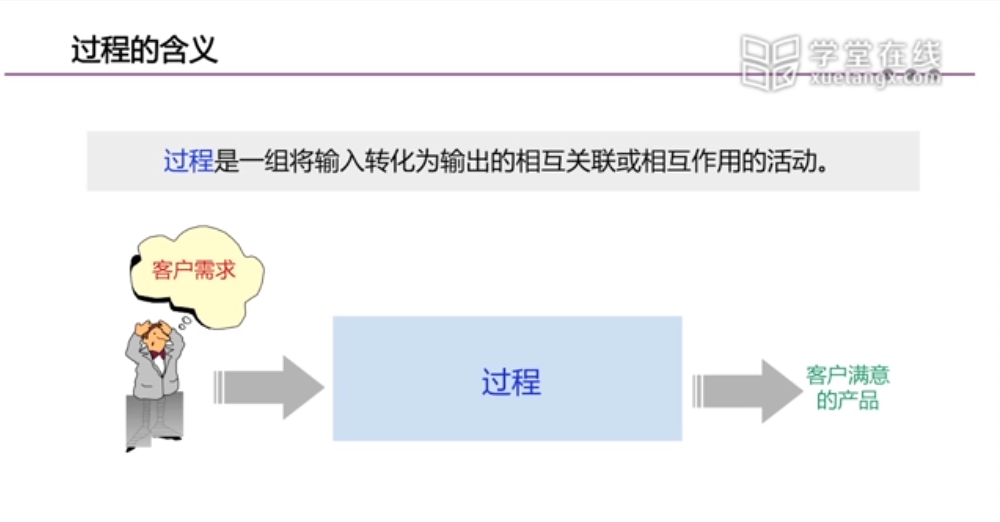
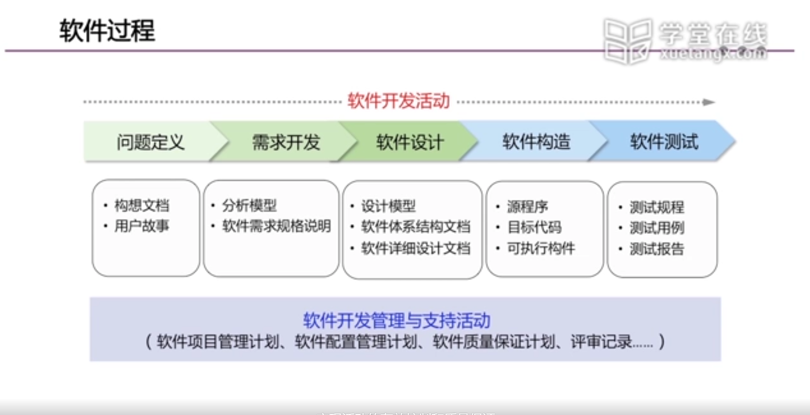

### 传统软件工程模型
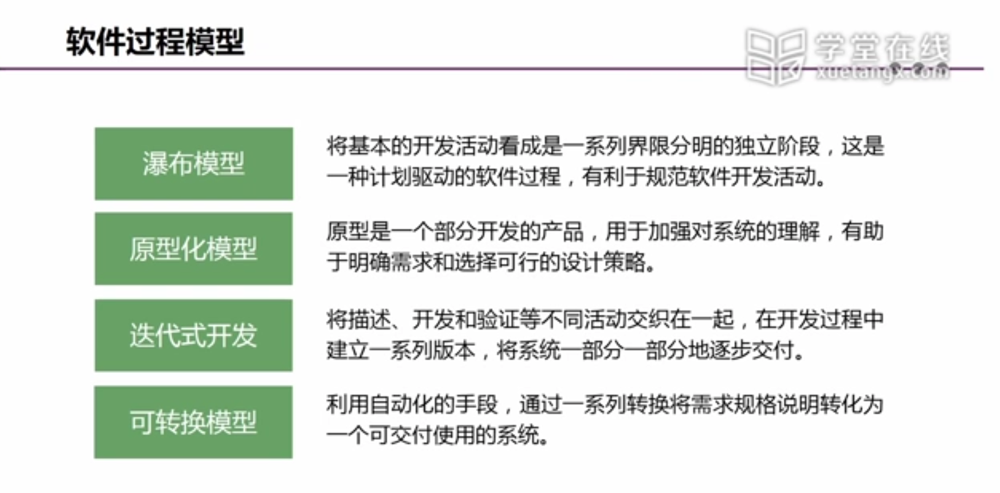

瀑布模型
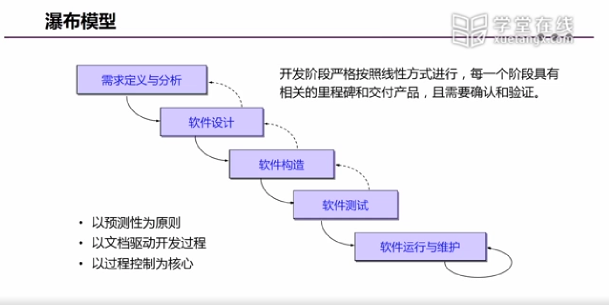
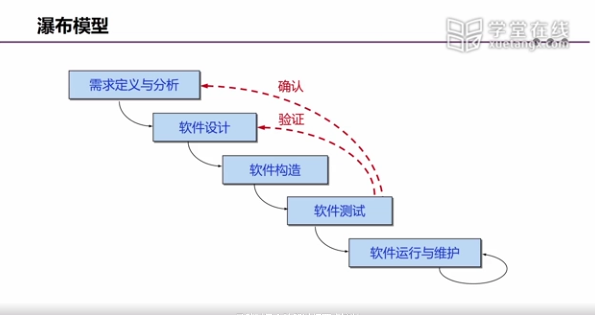

原型化模型
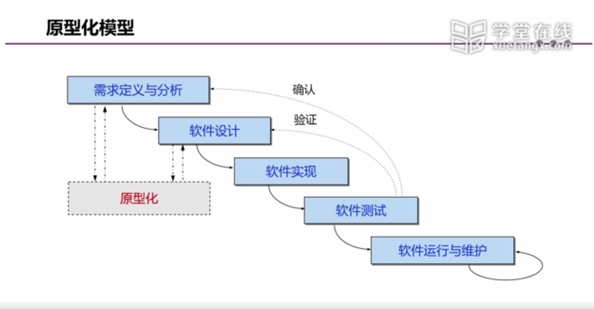

迭代式模型
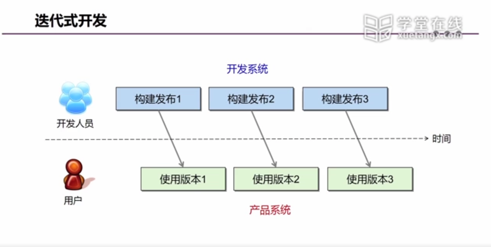

可转换模型
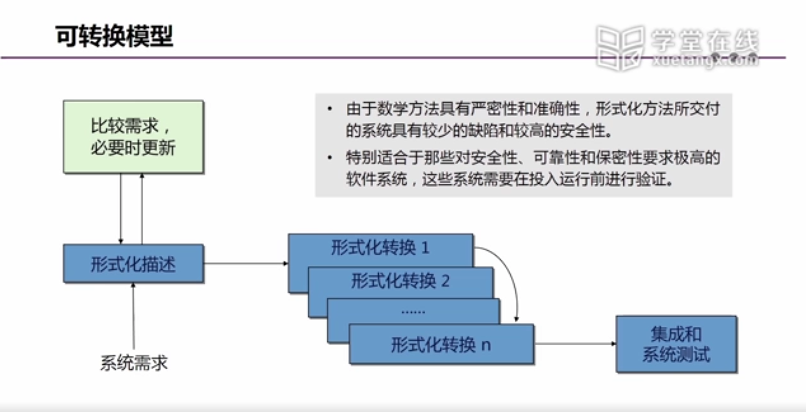

### 迭代模型特点以及适用场合
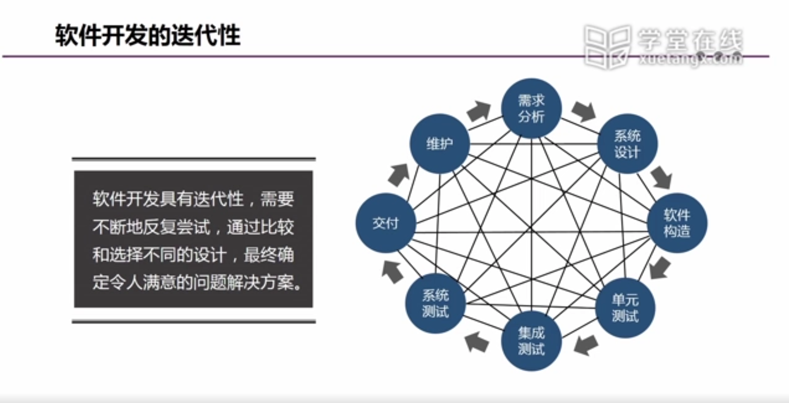

微信的开发是一种典型的迭代化模型，基本的微信框架建立是一个完整的系统。后续功能，由后续版本添加新的子系统

## 8需求获取
### 需求工程师的职责
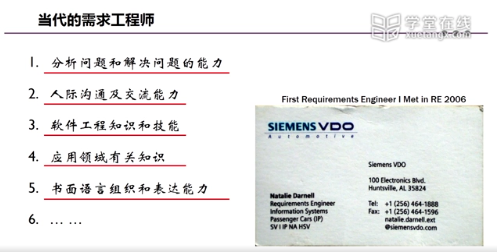
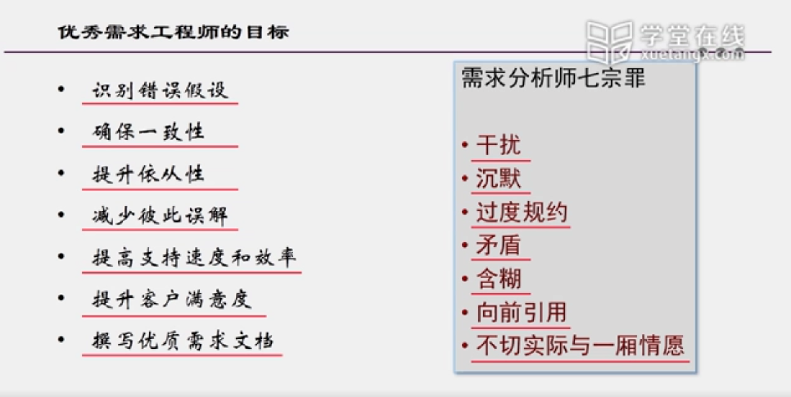
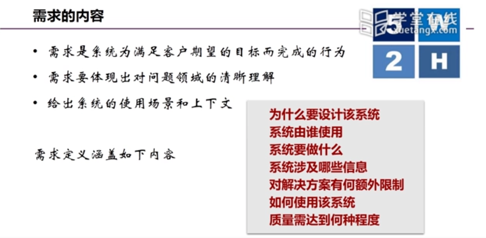

### 软件需求定义
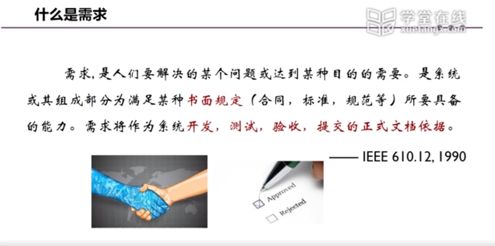

### 软件需求的框架
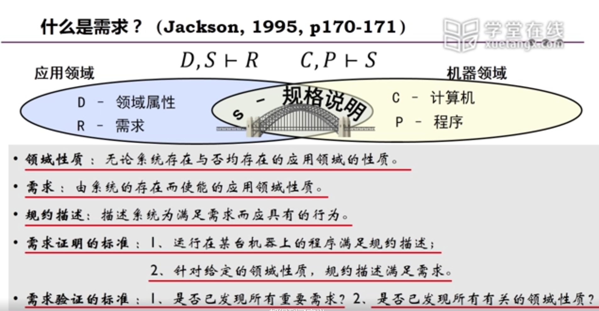
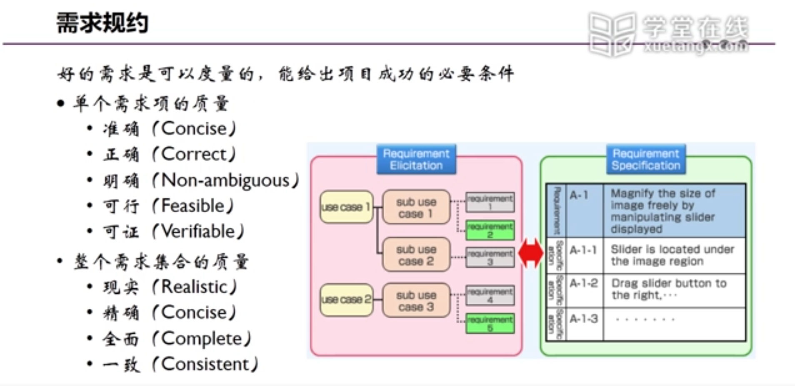