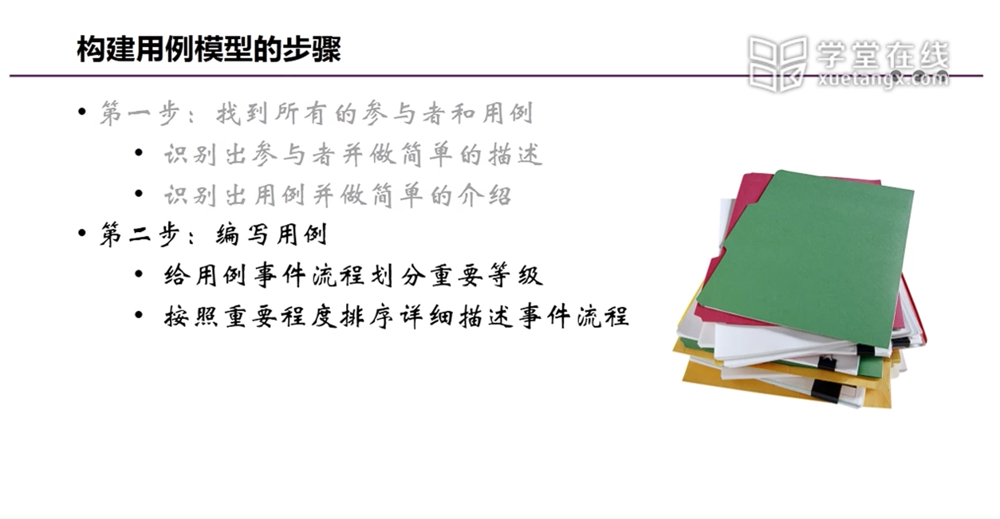

# 第四部分blog
## 用例建模
### 基本概念
#  
·功能性需求
    关联干系人需要以及软件需求
    确认与系统交互的人或对象（参与者）
    定义系统的边界
    捕捉传达系统的理想行为（用例）：
        文本
        用例图
    验证或者确认需求
    规划工具

用例图主要元素：
#  
·什么是用例
#  
#  
·什么是参与者
 # 
·什么是关联
# 

### 过程
·参与者
    # 
    # 
    # 
    # 
·用例
    # 
    # 
    # 
    # 
    # 

·过程
    # 
    # 
    # 
### 规范
# 
# 
# 
# 
# 
# 
