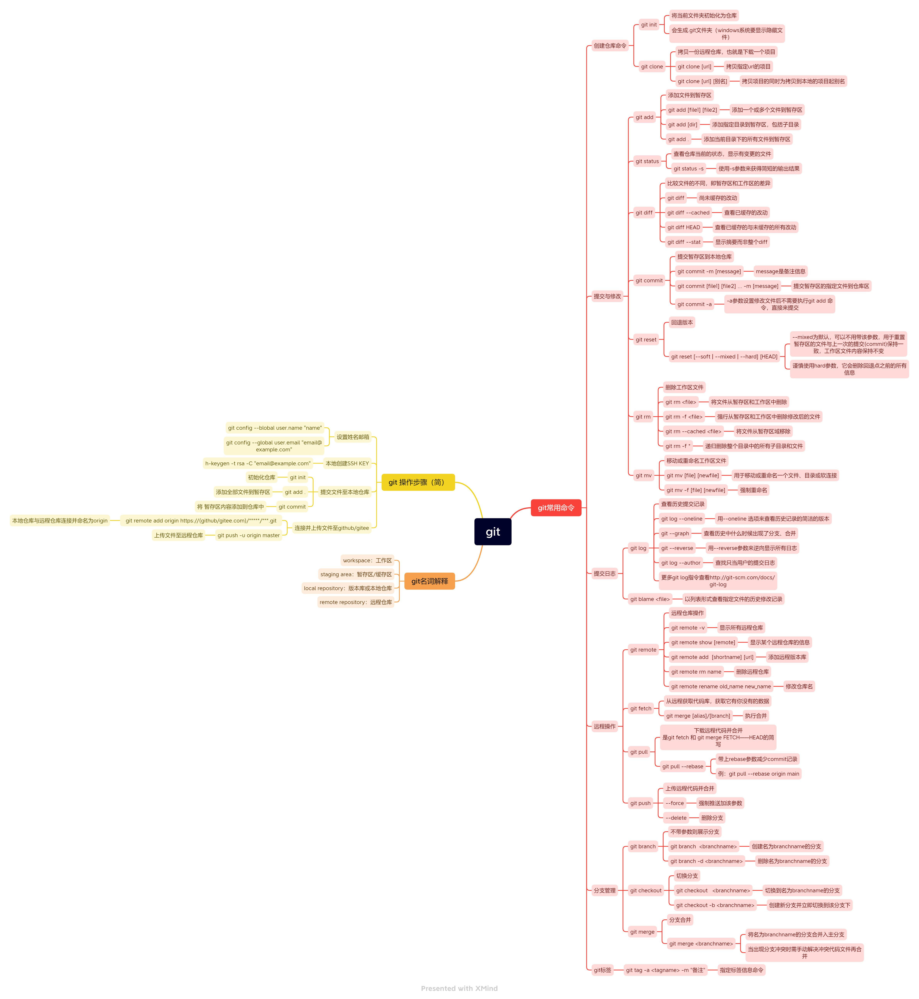

# 第四部分blog
## git基本用法
#  

git 
	config 
	init 初始化本地库
	status [] 查看库状态
	add [file] 新增文件
	commit 递交追踪文件的修改 生成日志
	log 查看库修改日志

	branch 创建工作分支
	checkout 切换分支
	merge 合并分支到当前分支

	clone复制远程仓库
	remote查看连接
	push跟新远程仓库